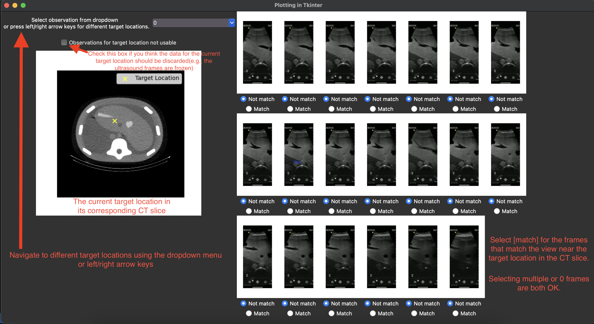

# About
This folder contains the GUI app for annotating the ultrasound scanning results. The GUI is developed using the tkinter package in Python.

# Data format
To use the annotation app, first ensure the ``data/`` folder is copied to this ``ResultAnnotation`` folder. 

The ``data/`` folder should contain a ``nifty/`` subfolder which holds the CT image ``CT_phantom_regular.nii.gz``.

The ``data/`` folder should also contain an ``observation/`` subfolder which holds the sequence of ultrasound scanning results. 
The scanning results will be in ``.pkl`` format, with names ``0.pkl,1.pkl,...,99.pkl``. 
Each of these ``.pkl`` files stores the scanning result for one particular target location.

# Python dependencies
- tkinter(https://docs.python.org/3/library/tkinter.html), library for the GUI, install by ``pip install tk``.
- SimpleITK(https://simpleitk.readthedocs.io/en/master/), library for reading the CT image, install by ``pip install SimpleITK``.
- pickle(https://docs.python.org/3/library/pickle.html), for reading and writting to the observation data, install by ``pip install pickle5``.
- numpy, matplotlib. Standard Python libraries for numerical manipulation and plotting.

# Running the app

In terminal, navigate to ``robotic-ultrasound/notebooks/ResultAnnotation``, then run ``$python app.py``.

# GUI

